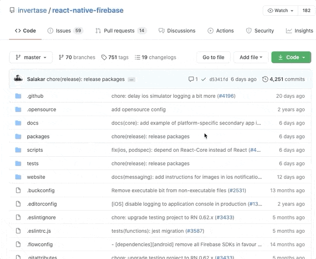

   

> Browser extension that provides a way to quickly view all changelogs in the current repo, with support for multi-package projects.

 

---

## Private Repos
In order to use this extension with private repos, you'll need to add your GitHub access token that will be used to query the API. Instructions are below.

## Permissions
- `"*://*.github.com/*"` for accessing the GitHub page.
- `storage` for storing GitHub access token and repo cache locally.
- `webRequest` for handling SPA page changes.
- `webNavigation` for handling SPA page changes.

## GitHub API Rate Limiting

This extensions uses the GitHub public API to query for all the changelogs in a repo. It will cache the results for a short amount of time, but you can still exceed the public quota. See [GitHub Rate Limiting](https://developer.github.com/v3/rate_limit/).

To solve this, you can add a GitHub personal access token.

1. Go to [https://github.com/settings/tokens](https://github.com/settings/tokens).
2. Generate a new token with the `repo` scope.
3. Click the extension icon in your browser toolbar, select the extension, options, then enter the access token in the window.

Each API request will now use your token.

## Privacy
This extension doesn't report any data and never phones home. The only data stored locally is your GitHub access token and repo cache.
